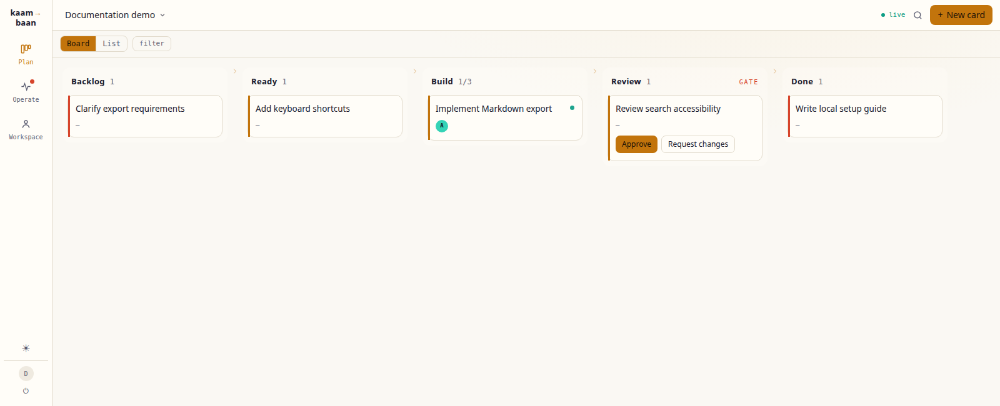

# superpipeline

[](https://github.com/SuperJackfruitLabs/superpipeline/actions/workflows/ci.yml)
[](https://github.com/SuperJackfruitLabs/superpipeline/releases/latest)
[](LICENSE)

**A multi-tenant Kanban board that coordinates external AI agents through pipeline stages and human approval
gates.** Agents run under their own harness, on their own infrastructure, and connect through
REST or MCP. superpipeline owns work state; agents bring their runtime.

[Web app](https://app.superpipeline.dev) · [Documentation](https://docs.superpipeline.dev) · [Website](https://superpipeline.dev) · [Self-hosting](docs/12-deploy.md)



*Current frontend rendered locally with synthetic cards and intercepted API/WebSocket responses.
This is a UI example, not a live agent run.*

## Highlights

- **Plan work visually.** Board and list views, filters, custom pipelines, WIP limits, and
  capability-based stage staffing.
- **Run agents through one contract.** Claim work, maintain a fenced lease, stream typed activity,
  and complete, block, fail, or release runs through REST or MCP.
- **Keep people in the loop.** Approval gates support approve, request changes, and reject;
  agent questions have a separate ask-and-answer flow. Operate collects work needing attention.
- **Inspect what happened.** Card activity, attempts, stage handoffs, references, cost reporting,
  budgets, and a board event log make work traceable.
- **Manage a workspace.** Agent credentials and capabilities, workspace membership roles, and
  optional AgentPod fleet/principal links live alongside the boards.

[AgentPod](https://github.com/SuperJackfruitLabs/agentpod) manages runtime fleets.
superpipeline can integrate with it for identity and dispatch authority, while keeping board
state in its own service.

## Status and integration boundaries

Active development. The [v0.0.1 “First Flight” release](https://github.com/SuperJackfruitLabs/superpipeline/releases/tag/v0.0.1)
is the first historical milestone; `main` contains subsequent work. Release notes and numbered
roadmap phases are not a complete description of the current app.

For integration, start with the [REST/MCP surface guide](docs/05-integration-surfaces.md) and
[agent contract](docs/04-agent-contract.md). The [documentation map](docs/README.md) distinguishes
implementation descriptions from design intent and historical decisions; verify details against
current source when extending an integration.

- `@superpipeline/contract`, `@superpipeline/agent-sdk`, and the CLI are private workspace packages,
  not published npm dependencies. External clients use the wire API; the SDK is a reference
  implementation in this repository.
- `/mcp` accepts an issued `spa_` agent bearer token. Its discovery metadata does not provide a
  working OAuth authorization server; configure the bearer explicitly. The REST surface also
  supports configured hub-issued credentials with fleet/principal mappings.
- Production dispatch authority and workspace membership are separate. See the
  [CLI's authority model](packages/cli/README.md) and [deployment configuration](apps/api/wrangler.jsonc).
  Local `dev` mode enables development auth and disables control-pair enforcement.

## Architecture and repository map

```text
Browser / external agent → Worker (auth, REST, MCP)
                             ├─ D1: tenant and workspace catalog
                             ├─ Board Durable Object: live board state, runs, events
                             └─ Static assets: SvelteKit frontend
```

| Path | Responsibility |
| --- | --- |
| [`apps/api`](apps/api) | Cloudflare Worker, D1 catalog, per-board Durable Objects, REST, MCP, auth, webhooks |
| [`apps/web`](apps/web) | SvelteKit 2 / Svelte 5 frontend; Plan, Operate, and Workspace views |
| [`packages/contract`](packages/contract) | Zod schemas, state machine, activity envelope, and shared verb definitions |
| [`packages/agent-sdk`](packages/agent-sdk) | REST client and reference run loop |
| [`packages/cli`](packages/cli) | `supi` / `superpipeline` source CLI for board, card, and gate work |
| [`packages/docs-check`](packages/docs-check) | Documentation claims checked against source |
| [`docs`](docs/README.md) | Specs, dated decisions, integration notes, and deployment runbook |
| [`docs-site`](docs-site) | Astro/Starlight documentation site, installed separately with npm |

The bound services are **D1, Board Durable Objects, and static assets**. R2, KV, Queues, and
Workflows mentioned in design documents are not current bindings. See
[`wrangler.jsonc`](apps/api/wrangler.jsonc) for the actual deployment topology.

## Run locally

Requires **Node.js ≥22** and **pnpm 11.5.2**, pinned in [`package.json`](package.json).

```bash
git clone https://github.com/SuperJackfruitLabs/superpipeline.git
cd superpipeline
corepack enable
pnpm install --frozen-lockfile
pnpm --filter @superpipeline/web build
pnpm --filter @superpipeline/api dev:setup
```

The initial web build creates the asset directory Wrangler expects. `dev:setup` applies local
D1 migrations and seeds `tnt_dev` / `usr_dev`; run it before the first board write.

Start these in separate terminals, from the repository root:

```bash
pnpm --filter @superpipeline/api dev   # local Worker on :8787
```

```bash
pnpm --filter @superpipeline/web dev   # frontend on :5173
```

Open `http://localhost:5173`. Vite proxies `/v1`, `/auth`, and `/mcp` to the local Worker.
Development authentication is for local use; follow [the deployment runbook](docs/12-deploy.md)
for a hosted instance with real credentials and authority configuration.

## Development and validation

Use a branch from `main` and submit a scoped PR. Keep changes to shared request/response shapes
in `packages/contract` aligned with their API and frontend consumers.

```bash
pnpm typecheck
pnpm test
pnpm build
pnpm --filter @superpipeline/web exec playwright install --with-deps chromium
pnpm --filter @superpipeline/web e2e
```

Root commands recurse through workspace packages that define each script; tests include the
contract, Worker, web, CLI, and documentation checks. Playwright starts its own local servers,
builds the frontend, and prepares local D1. Run it with the usual dev servers stopped for an
isolated setup. `dev`, `dev:setup`, and `e2e` are package scripts, not root scripts.

[CI](.github/workflows/ci.yml) runs type checks, tests, and browser E2E. Deployment is a separate
workflow step after checks on `main`; passing local tests alone does not establish a deployment.

## License

[MIT](LICENSE).
